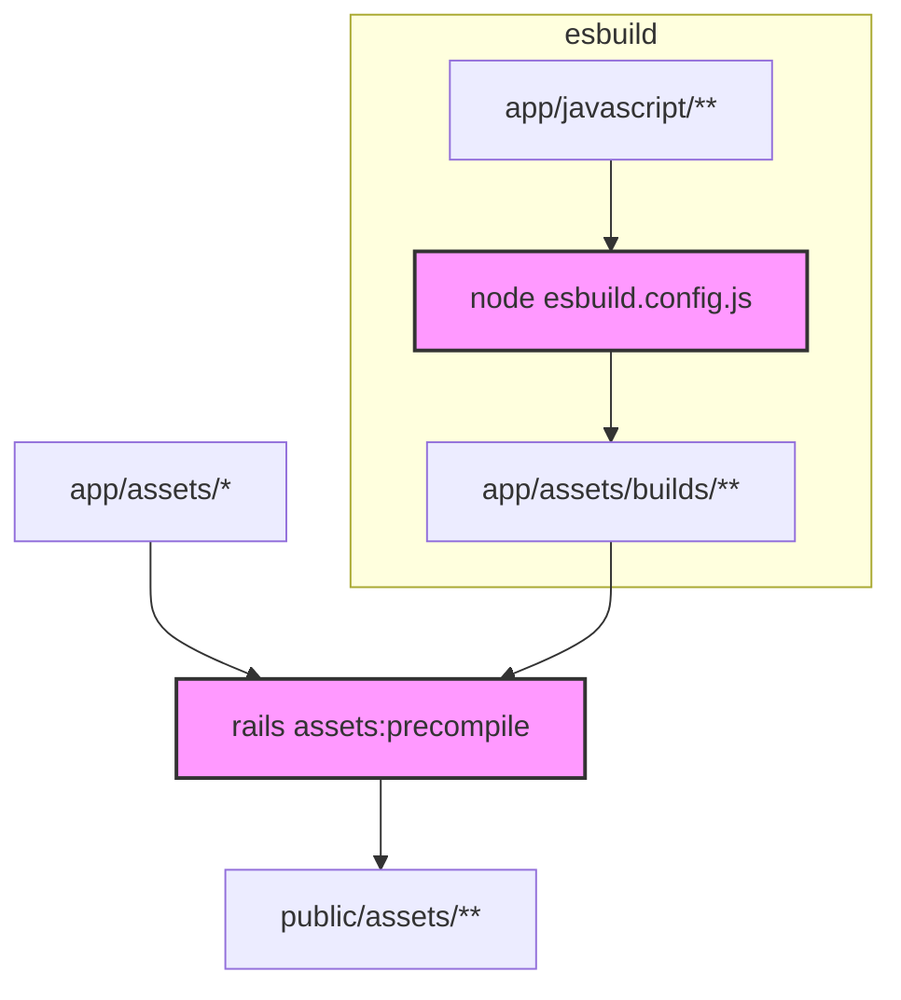

こんにちは、Freelance Developer の天海です。

お仕事で関わってるTAIANでやった34万行大規模な Rails app を Webpack から高速な JavaScript バンドラーである esbuild に移行したことを紹介します。この移行により、ビルド時間とメモリ使用量を大幅に削減し、パフォーマンスを向上させました。

⚡ フロントビルド（115.79倍高速）
⚡ 本番ビルド（2.42倍高速） 
⚡ 自動リビルド（2.48倍高速）
⚡ メモリ使用量（22.9%削減）


## やったこと

- jsbundling-rails で webpacker を置き換え
- esbuild.config.js の設定
- esbuild と Rails Assets Pipeline の統合
- その他の細かな対応

## 簡単な記録

### 1. jsbundling-rails で webpacker を置き換え

**苦労した一例：** jsbundling-railsとcssbundling-railsの違いが分かりにくい

Railsのフロントエンド統合に慣れていなかったため、最初はjsbundling-railsとcssbundling-railsの両方を導入し、前者はJS向け、後者はCSS向けだと思っていました。  
しかし実際にjsbundling-rails + esbuildを設定したところ、esbuildでSassも設定したら普通に動いてしまい、少し混乱しました。  
結局、cssbundling-railsは使わず、esbuildで JS・CSS・Images・Fonts など全てのフロントエンドリソースを一括処理しました。

Gemfileの差分例:

```diff
- gem 'webpacker'
+ gem 'jsbundling-rails'
```

esbuild.config.js で Sass を処理する例

```js
const context = await esbuild.context(
  plugins: [
    sassPlugin({
      filter: /\.module\.scss$/,
      type: 'local-css',
      loadPaths: [path.join(__dirname, 'app/javascript'), path.join(__dirname, 'node_modules')],
    }),
    ...
```

感想:

モダンなフロントエンドは JS・CSS・HTML・Images・Fonts などを厳密に区別する必要はなく、ほとんどのモダンツールはこれらを同様に扱い、一元管理可能です。Sassのコンパイルもesbuildで済むため、cssbundling-railsに依存しなくてよくなりました。

### 2. esbuild.config.js の設定

**苦労した一例：** SPAではなくMPA（マルチページアプリケーション）への対応

フロントエンドコミュニティではSPA（シングルページアプリケーション）が主流のため、esbuildの公式ドキュメントにMPAの設定例が不足していました。しかし、弊社のRailsプロジェクトはルーティングを多用するMPAであり、ページごとに異なるフロントエンドビルドが必要でした。esbuildは複数エントリポイントをサポートしているため、これを活用しました。

エントリポイントの例:
```js
// esbuild.config.js
const entryPoints = {  
  'crm/index': 'packs/crm/index.js',
  'crm/anniversary/index': 'packs/crm/anniversary/index.js',
  'crm/marketing/index': 'packs/crm/marketing/index.js',
  'crm/dashBoards/index': 'packs/crm/dashBoards/index.js',  
  'crm/setting/index': 'packs/crm/setting/index.js',
  
  // ...中略...
  crm: 'stylesheets/crm.scss',
  customer: 'stylesheets/customer.scss',
  application: 'stylesheets/application.scss',
}

const context = await esbuild.context({
  entryPoints: Object.entries(entryPoints).map(([outPath, entry]) => ({
    in: path.join(__dirname, 'app/javascript', entry),
    out: outPath,
  })),
  // ...
});
```

注意点:
esbuild-sass-pluginとesbuild-plugin-sassという類似した名前のプラグインが存在し、混同しやすいので注意が必要です。


### 3. esbuild と Rails Assets Pipeline を協調

**苦労した一例：** esbuild と Rails Assets Pipeline が共存しないといけない

jsbundling-railsとesbuildを導入しましたが、プロジェクトの複雑さとActiveAdminの依存により、esbuildとRails Assets Pipelineを共存させる必要がありました。結果として、フロントエンドのソースコードはesbuildとRailsの両方で処理される形になりました。



sass-railsは6年以上更新されておらず、Railsコミュニティでもメンテナンスが停止しています。可能な限り早急に廃止したいと考えています。


### 4. その他の細かな対応

#### 4.1 Webpack から esbuild へ移行の効果計測

esbuildはビルド時間計測機能が無いため、自作の esbuild plugin でを作成してビルド時間を記録しました。

```js
const context = await esbuild.context({
  plugins: [{
    name: 'log-rebuild-time',
    setup(build) {
      let startTime
      build.onStart(() => {
        startTime = Date.now()
        consola.start(`[esbuild] Building...`)
      })
      build.onEnd(() => {
        const now = new Date()
        const duration = now - startTime
        consola.log(`Time: ${duration}ms`)
        consola.log(`Built at ${now.toLocaleString('en-US', { hour12: true })}`)
      })
    },
  }],
  // ...
})
```

このコードはesbuild.config.jsに追加することで利用可能です。

#### 4.2 開発者ツールで React コンポーネントを直接特定

方法：開発環境では、Railsサーバーがフロントエンド資産を二重コンパイルしないよう設定します。

```ruby
# config/environments/development.rb
Rails.application.configure do
  config.assets.quiet = true
  config.assets.compress = false
  config.assets.digest = false
  # ...
end
```

### 5. 関連リンク

- [esbuild](https://esbuild.github.io)
- [jsbundling-rails](https://github.com/rails/jsbundling-rails)
- [cssbundling-rails](https://github.com/rails/cssbundling-rails)
- [webpacker](https://github.com/rails/webpacker)
- [ActiveAdmin](https://activeadmin.info/)
- [sass-rails](https://github.com/rails/sass-rails)
- [Rails Asset Pipeline (v7.2)](https://guides.rubyonrails.org/v7.2/asset_pipeline.html)

## 今後の課題

* 自動化されたE2Eテストの不足
    * 現在、E2Eテストの自動化が未着手であり、ページごとの手動確認に工数がかかっています。E2Eテストやビジュアルテストの自動化を早急に導入予定です。
* sass-railsの廃止
    * 7年間更新がないsass-railsは、Railsコミュニティでもメンテナンスされておらず、早急な除去が必要です。
* JavaScriptのバンドル最適化
    * 現在のJavaScriptのエクスポート設計が不適切で、不要なコードがバンドルされ、ファイルサイズが増大しています。これによるパフォーマンス問題を解消する必要があります。

以上、最後までお読みいただきありがとうございます。
